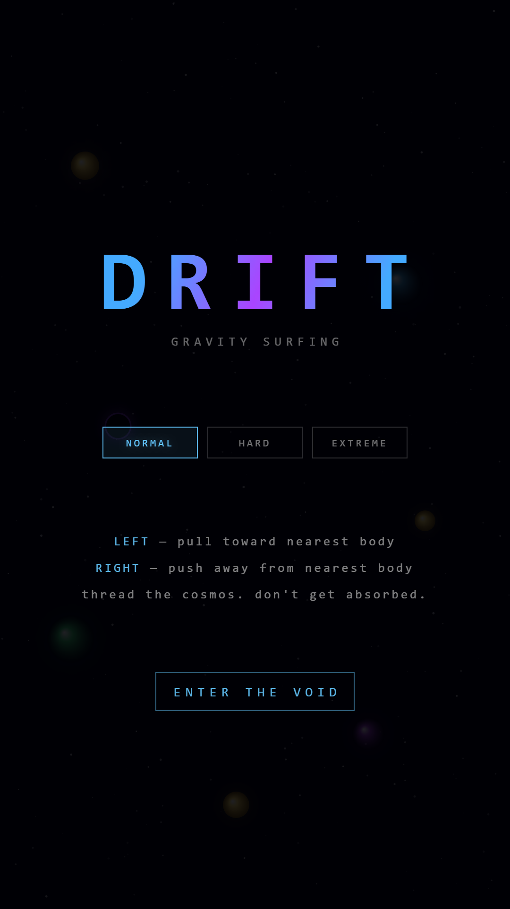
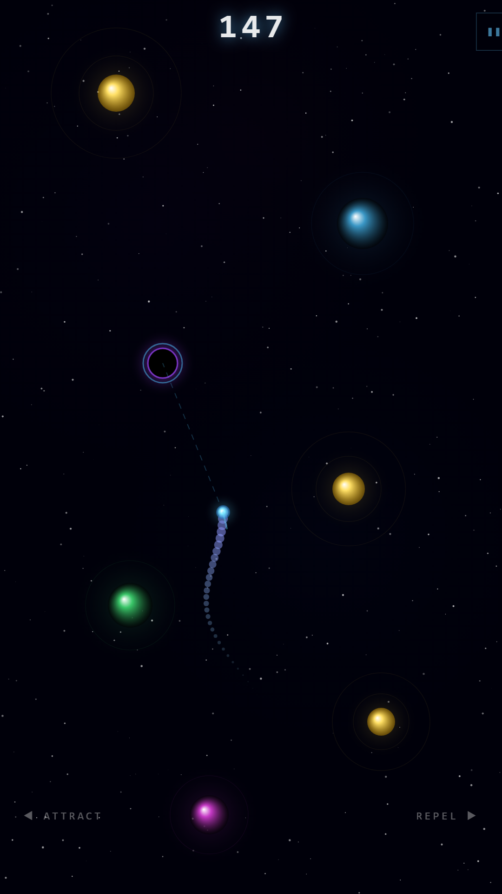
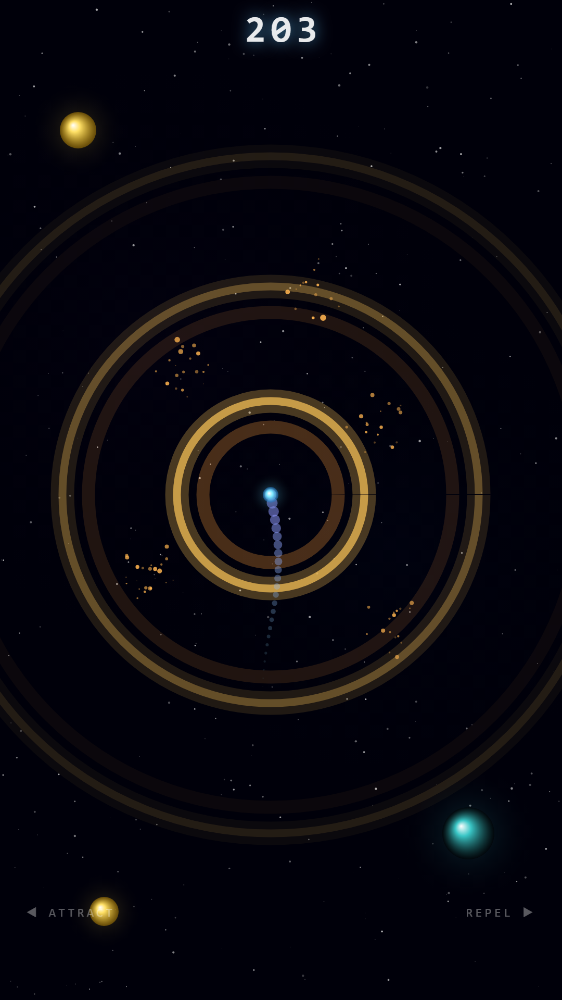
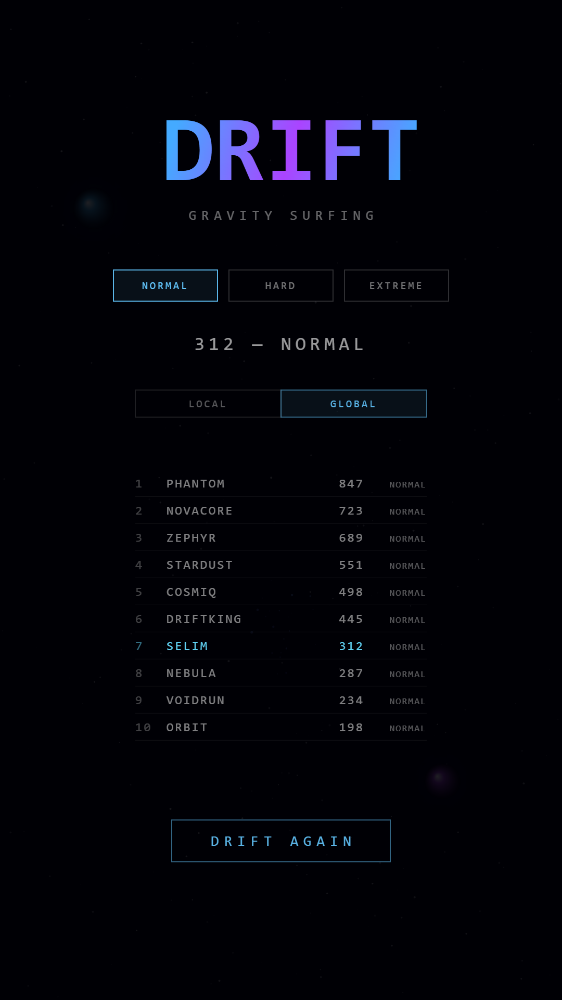

# Drift

A gravity surfing endless runner. You're a speck of light falling through the cosmos. Stars, planets and black holes scroll past — and instead of dodging them with thrusters like every other space game, you *use their gravity*. Pull yourself toward the nearest body. Push yourself away. Thread the needle. Don't get absorbed.

One HTML file, two canvases (PixiJS/WebGL for rendering, Canvas 2D as the preserved fallback). No bundler, no build step. It ships as an Android app via Capacitor.

## How to play

Two inputs. That's it.

- **Left side / ←  / A** — attract toward the nearest celestial body
- **Right side / → / D** — repel away from the nearest celestial body

The physics only cares about the *closest* body to you at any given moment. A soft ring highlights which one is currently pulling the strings. A dashed line appears when you're actively attracting or repelling so you can see exactly what's about to happen.

Survive. Your score is the number of bodies you've drifted past. Speed ramps up for the first ~200 points and then caps — after that it's pure precision.

### Things that will kill you
- Touching any star, planet, or black hole
- Flying off the edge of the screen

### Things that won't
- The first ~1.5 seconds after spawning (grace period — the player glows while invulnerable)

Top 5 scores are kept locally in `localStorage` and shown on the death screen.

## Features

- **Orb system with crystal progression** — five unlockable orbs (Cyan/Drifter, Cosmic/Phantom, Solar/Inferno, Nebula/Warp, Asteroid/Fortress), each with its own passive bonus and a unique burst ability. Runs earn 💎 Drift Crystals (score × difficulty multiplier, persisted in `localStorage`) that are spent in the shop to unlock new orbs
- **Burst mechanic** — press both sides at once to fire the equipped orb's signature burst ability on a 20-second cooldown. Every orb's burst resolves differently (instant powerup grant, chain destruction, shield refresh, stacked hyperspeed, etc.)
- **9 progressive planet types** — the pool rotates every 2 minutes through four phases: classic stars/planets/black holes → toothed + eye + cracked → tentacle + screaming + void → heart + mirror + skull. Several types carry dynamic hitboxes that match their animation (toothed spike tips, extending tentacles, pulsing hearts)
- **Apocalypse sequence** — survive 10 minutes and the world stops spawning, the player is pulled to the centre, and a giant sun descends for a cinematic end-of-run death
- **Phase-based music + backgrounds** — four gameplay tracks crossfade between phases so the soundtrack evolves with the threat level, and NASA space imagery is parallax-scrolled in sync with the current phase's mood
- **Tutorial/guide** — a six-page in-game guide (controls, powerups, scoring, burst, timer, orbs) accessible from the main menu
- **Combo system** — 9 powerup combinations (Supernova, Warp Time, Phantom Blast, Pulsar, Spectral Rush, Juggernaut, Wraith, Eternal Phantom, Fortress Shield), each with its own mechanics and visual identity
- **Pair spawning** — 1 in 5 powerup spawns is a tethered pair connected by a cosmic energy beam; grabbing either one triggers the matching combo instantly
- **Stacking hyperspeed** — pick up hyperspeed up to four times for a 4x speed run, with step-down expiry, gold/orange/red/white stack tints, and a blinking stack counter
- **Streak + time-bonus scoring** — destroy a planet via Nova, Hyperspeed barrier, or Phantom Blast and your next destroy is worth more (streak × 4 flat, cap 8); survive longer and a time bonus adds a score-proportional payout every 30 seconds
- **Run timer with danger zones** — HUD timer progresses white → orange → red, with visible danger-zone effects after the 3-minute mark
- **Real-time timer refactor** — every game timer is driven by wall-clock milliseconds instead of frame counters, so gameplay feels identical at 30, 60, and 120 Hz
- **Run summary on death** — full breakdown of planets passed, planets destroyed, longest streak, powerups used, and points from each source
- **Dynamic space background** — real NASA space imagery (nebulae, dying stars, galaxies, supernovae) parallax-scrolls behind the playfield, blended into the cosmos with a screen composite so only the coloured light shows
- **3 difficulties** — Normal, Hard, Extreme — with progressively faster scroll, more bodies, and more frequent powerup drops. Powerup frequency and tethered-pair spawn chance are now scaled per tier (Normal is the most generous, Extreme unchanged) so easier difficulties get more combo chains to compensate for the lower baseline pressure
- **Resume after crash** — gameplay state is snapshotted to `localStorage` every 5 seconds. If Android kills the app mid-run (backgrounded, OOM, driver reset), the main menu shows a RESUME button with the saved difficulty / survival time / score. Clicking it plays a 3-2-1 countdown and restores the run exactly where it was
- **Local + global leaderboards** — top 5 per difficulty stored locally; global top 10 served from a serverless AWS backend. Global top 10 entries are permanent (TTL attribute removed); positions 11+ expire after 7 days
- **Loading screen + TAP TO START** — boot shows a drifting star field and a progress bar while music/SFX buffers, background imagery, planet sprites, and warm-up gradients load in parallel. The final TAP TO START button satisfies the browser's user-gesture requirement for audio playback, so the menu track begins cleanly instead of the first-tap-anywhere hack
- **Analytics dashboard** — password-protected `/analytics` endpoint records per-run telemetry (death cause, phase reached, orb, powerups, burst count, streak, crystals earned) and serves a server-rendered HTML dashboard with overview stats, breakdowns, and per-pilot run history
- **Play In-App Updates** — the Android build uses Google Play's flexible in-app update flow to keep testers current without forcing them out of a run

## Tech stack

- **PixiJS 7 (WebGL)** — primary renderer for every game layer (star field, nebula, background imagery, bodies, player + trail, particles, powerups, destroy effects, screen overlays). Loaded via CDN (`pixi.min.js`); no bundler involved. Migrated from Canvas 2D in v1.6.0 to get GPU-accelerated sprite batching and eliminate Adreno driver mutex crashes on certain Qualcomm devices
- **HTML5 Canvas 2D** — preserved fallback path. If PIXI is unavailable (CDN blocked, WebGL disabled) the render loop falls back to the original Canvas 2D pipeline on `#c`
- **Vanilla JS, one file** — the entire game is still one `www/index.html`. No build step, no bundler, no app framework, no TypeScript, no asset pipeline. Just a `requestAnimationFrame` loop, some trig, and PixiJS as the draw backend
- **Capacitor 8** — wraps the web app into a native Android shell
- **Gradle / Android SDK** — for producing the APK/AAB

If you want to tweak the game, open `www/index.html` in a browser and hit refresh.

## Running it

### In a browser (fastest iteration loop)
```bash
# any static server will do
npx serve www
# or just open www/index.html directly
```

### On Android
You need the Android SDK and a JDK installed.

```bash
npm install
npx cap sync android
npx cap open android        # opens Android Studio
# or, from the command line:
cd android && ./gradlew assembleDebug
# APK lands in android/app/build/outputs/apk/debug
```

To produce a release build, sign it with your own keystore — see the [Capacitor docs on Android deployment](https://capacitorjs.com/docs/android/deploying-to-google-play).

### Tweaking the game

All the knobs live at the top of the `<script>` block in `www/index.html`:

```js
const PLAYER_R = 6;
const GRACE_FRAMES = 90;
const BODY_SPACING = 290;
const FORCE = 0.18;
const SPEED_MIN = 1.2;
const SPEED_MAX = 3.2;
const SPEED_SCORE_CAP = 200;
```

Want heavier gravity? Bump `FORCE`. Want a more forgiving ramp? Raise `SPEED_SCORE_CAP`. Want bodies closer together? Lower `BODY_SPACING`.

## Architecture

```
          API Gateway (HTTP API, CORS *)
          ├─ POST /score        ─▶ submit-score     ─▶ drift-leaderboard
          ├─ GET  /leaderboard  ─▶ get-leaderboard  ─▶   (top 10: no TTL, 11+: 7-day TTL)
          ├─ POST /analytics    ─▶ drift-analytics  ─▶ drift-analytics
          └─ GET  /analytics    ─▶ drift-analytics      (90-day TTL, dashboard HTML)

          All Lambdas: Node.js 20. All tables: DynamoDB on-demand.
```

The leaderboard is kept at the top 10 scores per difficulty via DynamoDB TTL tiering: every submission **removes** the TTL attribute from the current top 10 so they persist indefinitely, and sets a 7-day TTL on everything else. Scores dropping out of the top 10 pick up a fresh 7-day window on the next submission. No explicit deletes — the table self-prunes as 11+ entries age out.

## Online leaderboard

The game has a serverless AWS backend for global leaderboards. Two endpoints:

- **POST /score** — submit a score with `{username, score, difficulty}`. Validated server-side (alphanumeric username, score < 999999, difficulty must be NORMAL/HARD/EXTREME). On each submit the backend rebalances TTLs: the top 10 per difficulty have their TTL removed so they persist indefinitely, and positions 11+ are set to a 7-day TTL.
- **GET /leaderboard?difficulty=NORMAL** — returns the top 10 scores for a difficulty tier, sorted descending.

All infrastructure is defined as Terraform in `/infrastructure`. No hardcoded account IDs — everything is parameterized.

## Analytics dashboard

A separate password-protected endpoint records per-run telemetry so I can see how the game is actually being played:

- **POST /analytics** — fire-and-forget from the game on death. Records `sessionId` (anonymous UUID persisted in `localStorage`), `pilotName` (the player's chosen username), difficulty, orb, score, time survived, phase reached, death cause, planets destroyed/passed, powerups used, burst count, longest streak, and crystals earned. Rows expire after 90 days via DynamoDB TTL.
- **GET /analytics?password=…** — returns a self-contained HTML dashboard (dark theme matching the game): overview stats for the last 7 days, a three-column grid for difficulty / death causes / orb popularity, phase-survival progress bars, and a per-pilot table with click-to-expand run history. Auto-refreshes every 60 seconds.

Session IDs are generated client-side with `crypto.randomUUID` and stored locally — no login, no personal data, just a stable per-install identifier that links runs from the same device. Attaching the player's pilot name lets the dashboard surface per-player stats when the same person plays across difficulties.

## CI/CD

Infrastructure deploys automatically via GitHub Actions when files under `infrastructure/` change on `main`.

Authentication uses **OIDC federation** — GitHub Actions assumes an IAM role via OpenID Connect. No long-lived AWS credentials are stored anywhere. The trust policy is locked to `repo:selimcelem/drift:ref:refs/heads/main` so only pushes to main on this repo can deploy.

Pipeline: `terraform init` → `plan` → `apply -auto-approve`

## Screenshots

<table>
  <tr>
    <td></td>
    <td></td>
    <td></td>
    <td></td>
  </tr>
</table>

## Roadmap

Post-v1.6.0 plans:

- **Codex** — body types unlock on first destruction with a lore entry attached to each; progression state (crystals + unlocked orbs + codex) synced to the cloud via Google Play Games so it carries across installs
- **Visual upgrades** — now that the pipeline is on WebGL, adding fragment shaders for body auras, smoother tentacle animation via per-segment interpolation, and denser particle effects
- **Mobile audio bass fix** — low-frequency SFX (hyperspeed sustain, apocalypse rumble) currently clip on some Android speakers; re-EQ pass planned

## License

Copyright (c) 2026 Selim Celem. Source available for portfolio and educational viewing only. No permission is granted to redistribute, resell, or commercially use this software without explicit written permission.
